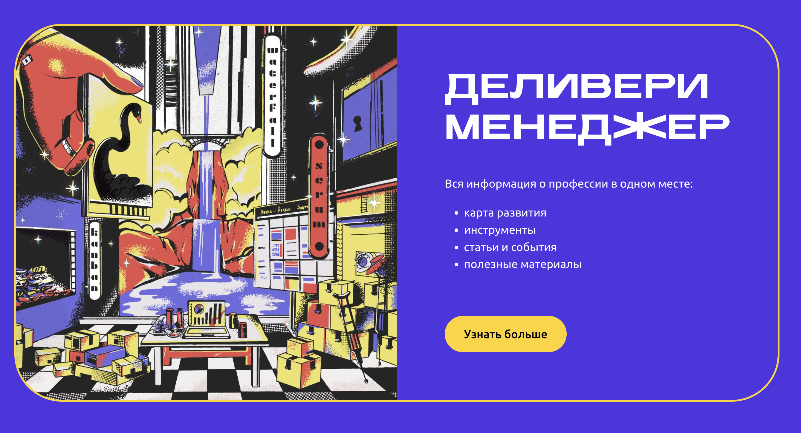

Новая, сочная главная страница профессии уже здесь

Команда проекта рада объявить о запуске новой домашней страницы базы знаний профессии деливери-менеджера.
Разрабатывая дизайн, мы хотели передать новизну профессии, её креативность. Не забыли и пасхалки оставить. Уже нашли парочку?

### Слова благодарности
Такая крутая главная страница была бы невозможна без продуктового дизайнера Марии Нестерович, frontend-разработчиков [Ирины Лес](https://github.com/MRCUCUMBER1234) и [Самандара Булатова](https://github.com/mephistorine).
Спасибо вам за ваше время, креатив и вовлечённость.

### Что дальше
Мы возвращаемся к активному развитию проекта: в блоге начнут регулярно появляться полезные посты, больше инструментов обретут свои карточки с описаниями.
Чтобы ничего не пропустить, подписывайтесь на telegram-канал [T-Process Improvement](https://t.me/channel_TAC).

Можно бесконечно смотреть на три вещи: как горит огонь, как течет вода и как смотрится дизайн на новой главной [deliverymanager.ru](https://deliverymanager.ru).