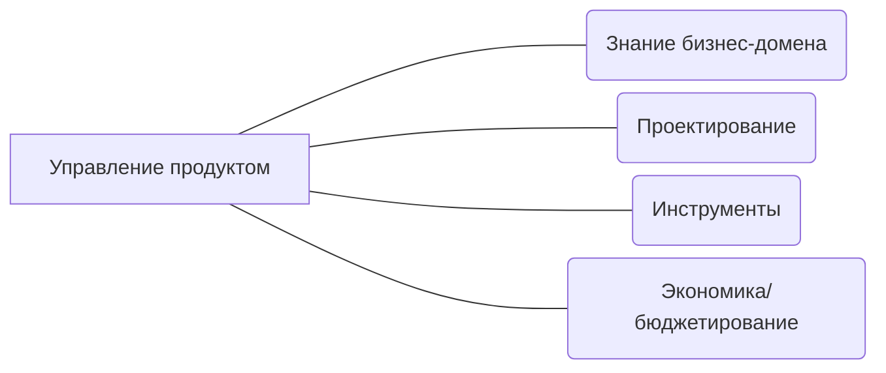

# Управление продуктом

## Из чего состоит

```mermaid
graph LR
%%{ init: { 'flowchart': { 'nodeSpacing': 10, 'rankSpacing': 200 }}}%%
    A[Управление продуктом] --- B1(Знание бизнес-домена) & B2(Проектирование) & B3(Инструменты) & B4(Экономика/бюджетирование)
```

## Дополнительные материалы
* [Книги, видео, подкасты](/docs/profession/good-to-know)
* [Анти-паттерны](/docs/profession/antipatterns)
